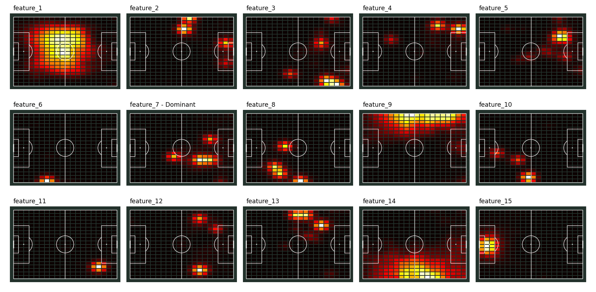
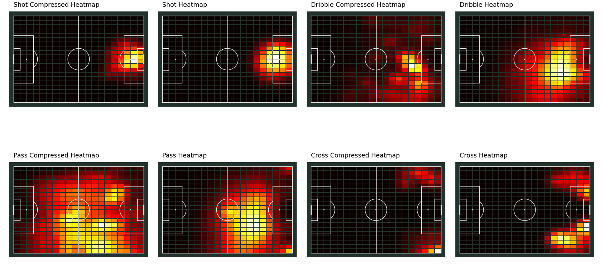
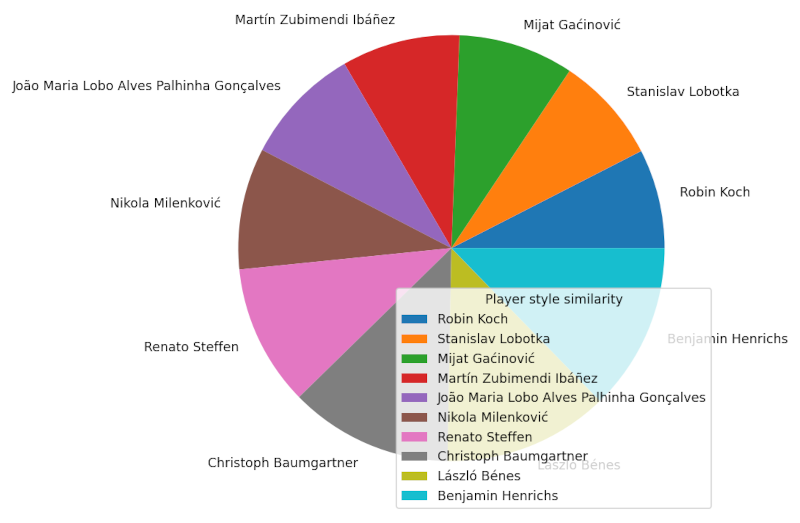

### Progress


## 1. Prerequisities

Only the publicly available football data provided by StatsBomb is used in the project.
The StatsBomb repository containing the data needs to be cloned first on the local machine
prior to running the data extraction scripts.
The command for cloning the repo is:
```
git clone https://github.com/statsbomb/open-data.git
```

After cloning the repo, the environment variable **OPEN_DATA_REPO_PATH** needs to be set to the 
value of the path where the "StatsBomb Open Data" repository is cloned to.
This is required by the **statsbombpy-local** utility library as explained on
the project's GitHub [page][1].

## 2. Project description

The projects contains an implementation of the **"Player Vectors"**, a method for characterizing the playing style of a player that can be used for scouting and monitoring of a player development. 
Similarity between two player's playing style is quantified by computing the Manhattan distance between their player vectors.
On offensive actions such as "Shot", "Pass", "Cross" and "Dribble" are taken into account when characterizing 
players' playing style. 

## 3. Project structure

* [datasets](./datasets) - folder with datasets
  * [euro2024_squads.csv](./datasets/euro2024_squads.csv) - squads of all Euro 2024 teams
* [src](./src) - source code folder
  * [calculate_pearson_correlation.py](./src/calculate_pearson_correlation.py) - determines Pearson correlation coefficient (r) for each type of action between different players and calculates the Manhattan distance between "r" vectors.
  * [compare_players_using_pearson_correlation.py](./src/compare_players_using_pearson_correlation.py) - finds players with the highest Pearson correlation coefficient values and the shortest Manhattan distance between Pearson correlation coefficient vectors.
  * [consts.py](./src/consts.py) - contains shared constants used in the project.
  * [create_actions_grid.py](./src/create_actions_grid.py) - creates actions heatmap grid for each player and saves the heatmap in CSV file.
  * [extract_players_played_time.py](./src/extract_players_played_time.py) - extracts and save to a file each player's total played time for all matches and t
  * [nmf_explained_variance_score.py](./src/nmf_explained_variance_score.py) - calculates the explained variance score and MSE for each action type.
  * [pitch_utils.py](./src/pitch_utils.py) - contains utility functions for working with **mplsoccer.Pitch** objects and the pitch grid.
  * [player_vectors.py](./src/player_vectors.py) - calculates the player vectors and saves data about action- and compressed action heatmaps.
  * [quantifying_players_similarity.py](./src/quantifying_players_similarity.py) - calculates Manhattan distance between player vectors for the players who participated in the "Euro 2024" tournament.
  * [visualize_compressed_heatmap.py](./src/visualize_compressed_heatmap.py) - displays a pitch grid with feature vectors for the specified player and the action type.
  * [visualize_heatmap.py](./src/visualize_heatmap.py) - displays a pitch grid with the action- and reconstructed action heatmaps alongside reconstructed for comparison.
  * [visualize_player_styles.py](./src/visualize_player_styles.py) - displays players whose player vectors have the shortest Manhattan distance to the player vectors of the target player.
  

## 4. Implementation details

The project implementation can be divided into following parts:
1. Extracting players total played time per match
2. Creating actions grid
3. Calculating players vectors
4. Visualizing player actions heatmap
5. Querying for players with similar play style

### 4.1. Extracting players total played time per match

The script **src/extract_players_played_time.py** calculates players total played time per match and stores it in a CSV file.
The destination file is defined by the value of the constant **PLAYERS_TOTAL_PLAYED_TIME_FILE_PATH** which is defined in the file **src/consts.py**.

> The played time during extra time is not included in the total played time, just regular 90 minutes   

### 4.2. Creating actions grid

The script **src/create_actions_grid.py** splits the football pitch into a specified number of tiles as defined by the constant value **HEATMAP_TILE_SIZE** (**src/consts.py**).
This action grid is basically a heatmap containing a summary of the locations where player **p** performs actions of type **t**.

As described in the "Definition 1" in the [paper][2]:

*"A players playing style can be characterized by his preferred area(s) on the field to occupy and which actions he tends to perform in each of these locations."*

This solution focuses on the four types of player actions:
* Shot
* Dribble
* Pass
* Cross ([Appendix 6: Cross][3])

The action grid output file will have the following columns:
* player_id
* grid_index
* end_grid_index
* Shot
* Pass
* Dribble
* Cross

The columns **grid_index** and **end_grid_index** represent the index of the football pitch tile on which a player's action started and
the index of the football pitch tile on which the action ended. 

The **end_grid_index** column value is set only for the **Pass** and the **Cross** events.

Player actions are grouped by the **player_id**, **grid_index** and the **end_grid_index** columns.

The output file is defined by the constant value **ACTIONS_GRID_FILE_PATH** (**src/consts.py**).

> The function **load_events_single_proc** in the **src/create_actions_grid.py** script is used in cases when the Statsbomb events loading process needs to be debugged. By default, the line that calls this function is commented and the multiprocess solution is used instead.

### 4.3. Calculating players vectors

The script **src/player_vectors.py** creates the heatmap and the compressed heatmap vectors. 
The compressed heatmap vectors are created using the non-negative matrix factorization (NMF) 
which is a dimensionality reduction and feature extraction algorithm.

The NMF algorithm decomposes the original matrix (m x n) into two matrices:
the feature matrix W (m x k) and the coefficient matrix H (k x n).
The dimension "k" corresponds to the number of principal components.

The numbers of principal components for the each of player vector components is 
set to:
* Dribble = 25
* Shot = 8
* Pass = 90
* Cross = 6
With this principal components combination, the solution found by the NMF algorithm
achieves at least 70% variance explainability in the heatmaps of each action type. 

After the process of creating the heatmap and the compressed heatmap vectors is finished,
both vectors are saved in specific files for each of the action types.
The Numpy data related to the compressed heatmap vector is stored into two separate files:
**compressed_heatmap_{action_type}_W.npy** and **compressed_heatmap_{action_type}_H.npy**, where
the **"action_type"** refers to the current action type being processed.
The Numpy matrix with the non-compressed heatmap vector data is also stored in a file following the format 
**actions_heatmap_{action_type}.npy**.

### 4.4 Measuring performance of dimensionality reduction

The performance of the dimensionality reduction is measured using the [nmf_explained_variance_score.py](./src/nmf_explained_variance_score.py) script.
For each action type vector the script outputs the explained variance score and the mean squared error.

For an example, for the following components per action type configuration:
* Shot - 6
* Pass - 15
* Cross - 4
* Dribble - 15

, the script output would look similar to the one shown below:
```
Explained variance score for action type 'Shot is 0.6974717616219436.
MSE for action type 'Shot is 2.1943833801747277e-07.
Explained variance score for action type 'Dribble is 0.6422496972965389.
MSE for action type 'Dribble is 2.851495430730488e-07.
Explained variance score for action type 'Pass is 0.4043071367771277.
MSE for action type 'Pass is 1.2061029279958553e-05.
Explained variance score for action type 'Cross is 0.7408327544188763.
MSE for action type 'Cross is 2.1693711255628049e-07.
```

### 4.4 Workflow

Steps:

1. Adjust the **HEATMAP_TILE_SIZE** constant value if needed. 
   In case the values are modified, the **src/action_grid.py** needs to be run again in order for the action grid to be re-created.
   The higher the number of components, the higher the accuracy of the model, but also the higher the risk of overfitting and computational cost.
   > For the entire list of pros and cons of higher vs lower number of components please refer to the [Table 1](#table-1-higher-vs-lower-number-of-components).
2. Run the [extract_player_played_time.py](./src/extract_players_played_time.py) script to extract each player's total played time per match and the total played time for all matches.
3. Run the [create_actions_grid.py](./src/create_actions_grid.py) script to create a grid of player actions, where actions are grouped per the grid tile.
   Maximum number of action grid tiles is defined with the constant value **MAX_TILES**.
4. Create player vectors by running the [player_vectors.py](./src/player_vectors.py) script.
5. After the player vectors are created, you can optionally run the [nmf_explained_variance_score.py](./src/nmf_explained_variance_score.py) script to check how well the NMF model fits the input data.
   Perfect result would yield value of 1. 
6. Calculate the Manhattan distance between player vectors by running the [quantifying_players_similarity.py](./src/quantifying_players_similarity.py) script.
7. Visualize similarities between player vectors by running the [visualize_player_style.py](./src/visualize_player_styles.py) script.
8. Optionally run [calculate_pearson_correlation.py](./src/calculate_pearson_correlation.py) script to calculate Pearson correlation coefficient for each action type.
9. If step 8 is run, print players that have the highest similarity of Pearson correlation coefficient for each action type. 

> Rather than using the compressed heatmap, comparison of players' playing styles using Pearson correlation coefficient is done using the original heatmap data. 

#### Table 1: Higher vs lower number of components
| Number of components | Pros                                                                                        | Cons                                                                            |
|--------------------------------------------------------------|---------------------------------------------------------------------------------------------|---------------------------------------------------------------------------------|
| Higher Number                                                | - Better reconstruction accuracy<br/>- More expressive</br>- Captures complex data patterns | - Risk of overfitting</br>- Harder to interpret<br/>- Higher computational cost |
| Lower Number                                                 | - Better interpretability<br/>- Less overfitting<br/>- Faster and more efficient | - Loss of detail<br/>- Risk of underfitting<br/>- Less expressiveness |

### 4.5 Data visualization

The basic data visualization is done using the following scripts:

* [visualize_compressed_heatmap.py](./src/visualize_compressed_heatmap.py) - shows N features from the compressed heatmap vector.
* [visualize_heatmap.py](./src/visualize_heatmap.py) - shows the reconstructed and the input heatmap for each action type side by side.  
* [visualize_player_styles.py](./src/visualize_player_styles.py) - shows simple pie chart containing the names of players with similar playing style.

### 4.5.1. Compressed heatmap data visualization

The compressed heatmap data is visualized using a grid of pitches where each pitch displays single 
feature from the features vector.


*Lionel Messi features vector data*

### 4.5.2. Heatmap data visualization

The chart shows the reconstructed and the input heatmap for each action type side by side.


*Lionel Messi heatmap data*

> The pitch with the reconstructed heatmap will look similar to or be drastically different from the pitch 
> containing the original heatmap depending on the number of components chosen for each action type before 
> training the NMF model. The higher is the number of components the lower will be the reconstruction error.

### 4.5.3. Visualization of players with similar playing style

This simple pie chart containing the names of players whose playing style is the most similar to the playing
style of the specified player:

                                                                                      
*Players with similar playing style to Joshua Kimmich*

## References

[1]: https://ecmlpkdd2019.org/downloads/paper/701.pdf
[2]: https://github.com/tanzhijian/statsbombpy-local?tab=readme-ov-file#configuration
[3]: https://github.com/statsbomb/open-data/blob/master/doc/Open%20Data%20Events%20v4.0.0.pdf

